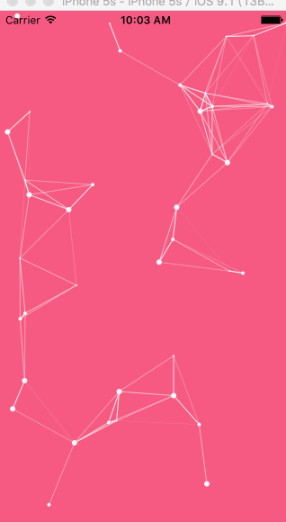

# ECParticleBackgroundView


## Usage

To run the example project, clone the repo, and run `pod install` from the Example directory first.

## Screenshot



## Installation

ECParticleBackgroundView is available through [CocoaPods](http://cocoapods.org). To install
it, simply add the following line to your Podfile:

```ruby
pod "ECParticleBackgroundView"
```

## Author

Eleven Chen, skyhacker@126.com

## License

ECParticleBackgroundView is available under the MIT license. See the LICENSE file for more info.
